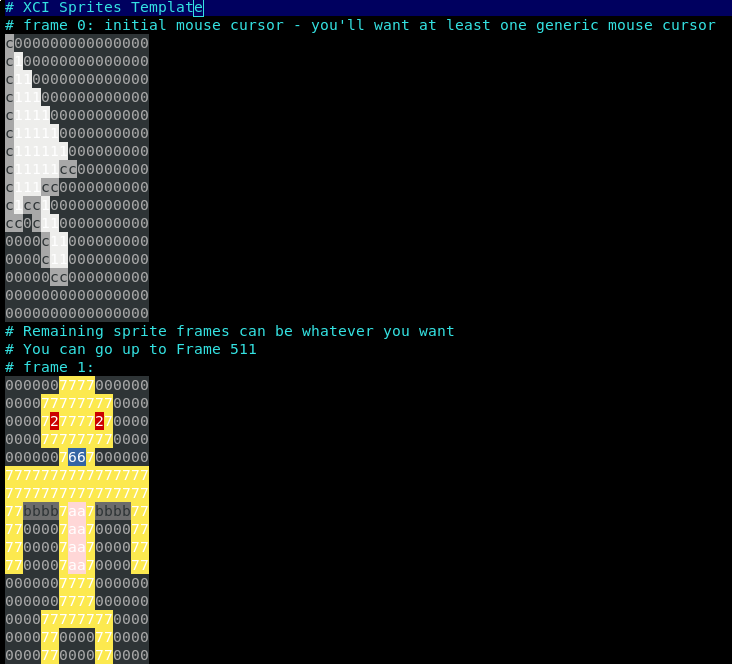
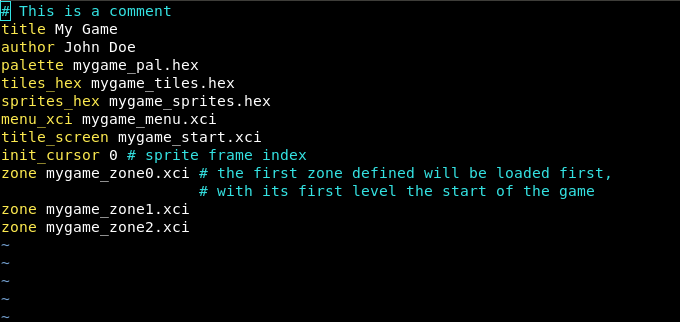
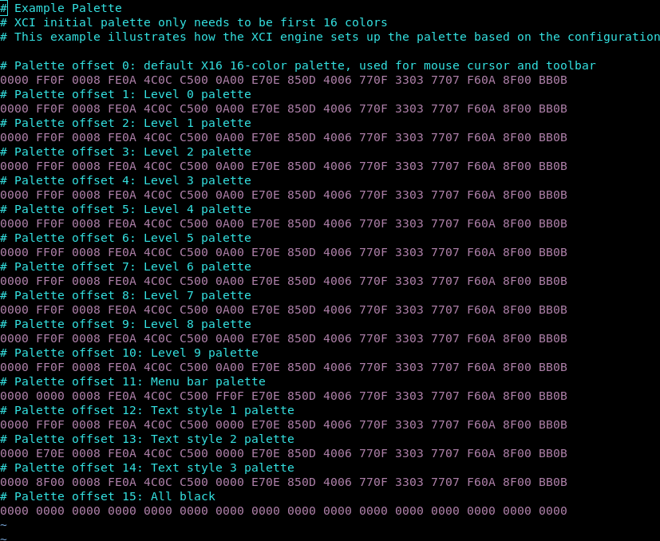
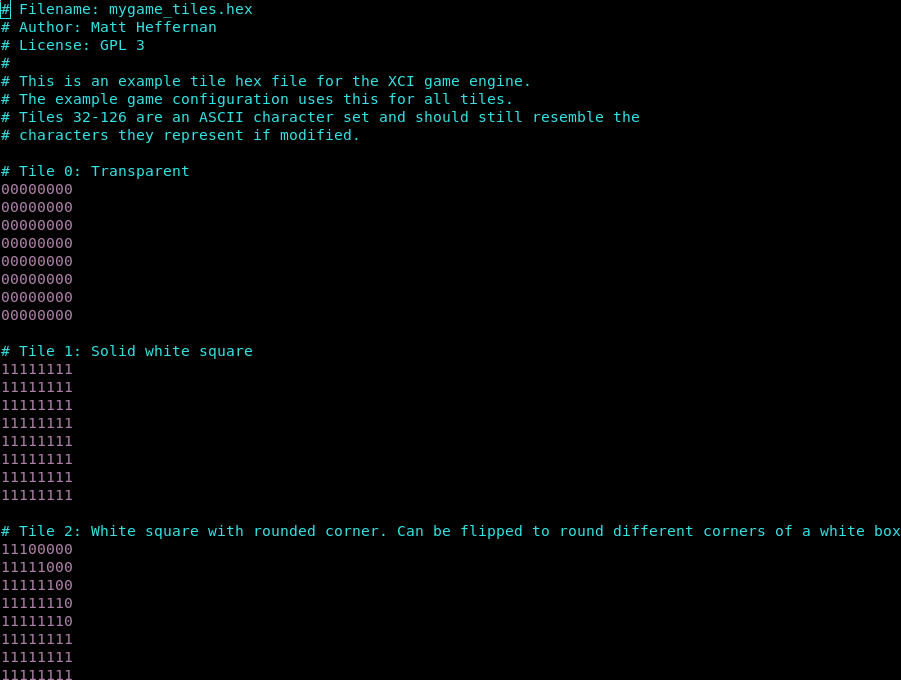

# vim-xci

[Vim](https://www.vim.org/) plugin to support syntax highlighting for the [XCI
game engine](https://github.com/SlithyMatt/x16-xci) software development kit
configuration language for the [Commander X16](https://www.commanderx16.com)
retro computer.

## Installation

- [Vundle](https://github.com/VundleVim/Vundle.vim)

        Plugin 'jestin/vim-xci'

- [vim-pathogen](https://github.com/tpope/vim-pathogen)

        cd ~/.vim/bundle && \
        git clone https://github.com/jestin/vim-xci --depth 1

- [vim-plug](https://github.com/junegunn/vim-plug)

        Plug 'jestin/vim-xci'
        :PlugInstall

- Or manually, clone this plugin to `path/to/this_plugin`, and add it to `rtp` in vimrc

        set rtp+=path/to/this_plugin

## Configuration

Due to issues with different version of vim and different package managers, and
different .vimrc files, there may be issues with the filetype detection of the
`.xci` files.  A simple way to ensure that vim properly detects `.xci` files is
by use of an autocommand:

		autocmd BufRead,BufNewFile *.xci set filetype=xci

Placing the above code in .vimrc should force the filetype to detect properly.

## Features

Not only does this plugin provide typical syntax highlighting, but it also
comes with a special `hex_tile` filetype that will attempt to highlight
hexidecimal tile and sprite data as to mimic the colors in the default XCI
palette:

To use this feature, simply open a hex file and use the command `:setfiletype hex_tile`.

To change the colors to use a different palette, you will need to redefine the
colors of the highlight groups in vim using the `highlight` command:

		highlight hexTileCol3 ctermbg=cyan guibg=cyan

There is a separate highlight group for each hex character.  They are:

* `hexTileCol0`
* `hexTileCol1`
* `hexTileCol2`
* `hexTileCol3`
* `hexTileCol4`
* `hexTileCol5`
* `hexTileCol6`
* `hexTileCol7`
* `hexTileCol8`
* `hexTileCol9`
* `hexTileColA`
* `hexTileColB`
* `hexTileColC`
* `hexTileColD`
* `hexTileColE`
* `hexTileColF`

## Screenshots

